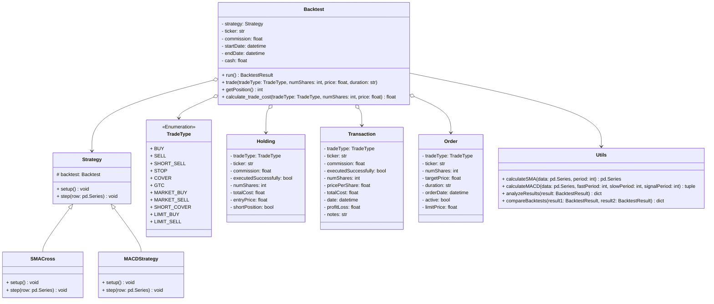

# Stock Trading Backtest Framework

A Python framework for backtesting trading strategies with support for multiple order types and technical indicators. Licensed under the LGPL.

> Email ben567755 [at] gmail[.]com with questions
>

---
## Install
#### pip install pyBacktest
> Docs can be found in the wiki tab. Docs are a work in progress.
---

## Features

### **Trading Operations**
- [x] **Market Orders** (Buy/Sell)
- [x] **Limit Orders**
- [x] **GTC (Good Till Canceled) Orders**
- [x] **Short Selling** (Sell and Cover Short Positions)
- [x] **Commission Handling**
    - [x] Flat Fee
    - [x] Percentage
    - [x] Per Share
- [x] **Order Expiry Handling**
    - [x] Automatically cancels expired orders
- [x] **Order Queue Management**
    - [x] Pending Orders handled by priority queue

### **Technical Indicators**
- [x] **Simple Moving Average** (SMA)
- [x] **Exponential Moving Average** (EMA)
- [x] **Relative Strength Index** (RSI)
- [x] **Bollinger Bands**
- [x] **MACD** (Moving Average Convergence Divergence)
- [x] **Crossover Detection** (SMA, EMA, MACD)
- [x] **Volume Weighted Average Price** (VWAP)
- [x] **Average True Range** (ATR)
- [x] **Indicator Calculation Integration**
    - [x] SMA, EMA, MACD available within strategy context

### **Portfolio Management**
- [x] **Position Tracking**
    - [x] Track open positions and entry points
- [x] **Transaction History**
    - [x] Records details of executed trades
- [x] **Portfolio Valuation**
    - [x] Calculates current portfolio value based on market prices
- [x] **Cash Management**
    - [x] Tracks available cash for trades
- [x] **Performance Metrics**
    - [x] Risk metrics, returns, and other performance statistics (e.g., Sharpe ratio, Drawdown, etc.)


## Example

```python
import pyBacktest as pbt
from pyBacktest.strategy import Strategy
from pyBacktest.utils import calculateSMA, analyzeResults, calculateMACD
from pyBacktest.tradeTypes import TradeType
from datetime import datetime
import pandas as pd

class SMACross(Strategy):
    def setup(self) -> None:
        self.has_position = False
        self.entry_price = 0
        self.sma20 = calculateSMA(self.data['Close'], 20)
        self.sma50 = calculateSMA(self.data['Close'], 50)

    def step(self, row: pd.Series) -> None:
        if row.name not in self.sma20.index or row.name not in self.sma50.index:
            return

        if self.backtest.cash>row['Close'] and self.sma20[row.name] > self.sma50[row.name]:
            self.has_position = True
            self.entry_price = row['Close']
            self.backtest.trade(TradeType.BUY, int(self.backtest.cash*0.95/row["Close"]), row['Close'], "DAY")
        elif self.has_position and self.sma20[row.name] < self.sma50[row.name]:
            self.has_position = False
            self.backtest.trade(TradeType.SELL, self.current_position, row['Close'], row.name)

class MACDStrategy(Strategy):
    def setup(self) -> None:
        self.macd, self.signal, self.histogram = calculateMACD(self.data['Close'])

    def step(self, row: pd.Series) -> None:
        if row.name not in self.macd.index:
            return

        if self.histogram[row.name] > 0:
            numShares = int(self.backtest.cash / row['Close'])
            trade_cost = self.backtest.calculate_trade_cost(TradeType.BUY, numShares, row['Close'])
            if self.backtest.cash >= trade_cost:
                self.backtest.trade(TradeType.BUY, numShares, row['Close'], "DAY")
        elif self.histogram[row.name] < 0 and self.backtest.getPosition() > 0:
            numShares = self.backtest.getPosition()
            trade_cost = self.backtest.calculate_trade_cost(TradeType.SELL, numShares, row['Close'])
            if self.backtest.cash >= trade_cost:
                self.backtest.trade(TradeType.SELL, numShares, row['Close'], row.name)

if __name__ == "__main__":
    sma_backtest = pbt.Backtest(
        strategy=SMACross(),
        ticker='AAPL',
        commision=1.00,
        startDate=datetime(2020, 1, 1),
        endDate=datetime(2024, 1, 1), 
        cash=10000
    )
    
    macd_backtest = pbt.Backtest(
        strategy=MACDStrategy(),
        ticker='AAPL',
        commision=1.00,
        startDate=datetime(2020, 1, 1),
        endDate=datetime(2024, 1, 1), 
        cash=10000
    )
    
    sma_results = sma_backtest.run()
    macd_results = macd_backtest.run()
    
    analyzeResults(sma_results)
    analyzeResults(macd_results)
    
    comparison = pbt.utils.compareBacktests(sma_results, macd_results)
    print("\nComparison of SMA and MACD Strategies:")
    print(f"Final Value Difference: ${comparison['final_value_diff']:,.2f}")
    print(f"Total Return Difference: {comparison['total_return_diff']:.2f}%")
    print(f"Number of Transactions Difference: {comparison['num_transactions_diff']}")
    print(f"Better Strategy: {comparison['better_strategy']}")
```

---

## Diagrams
> Diagrams are not guaranteed to be up to date.
### Structure


### Backtest callchain


### Components


### State Diagram

### Data Flow

### Interaction Overview


### Error Handling


### Dependincies 

